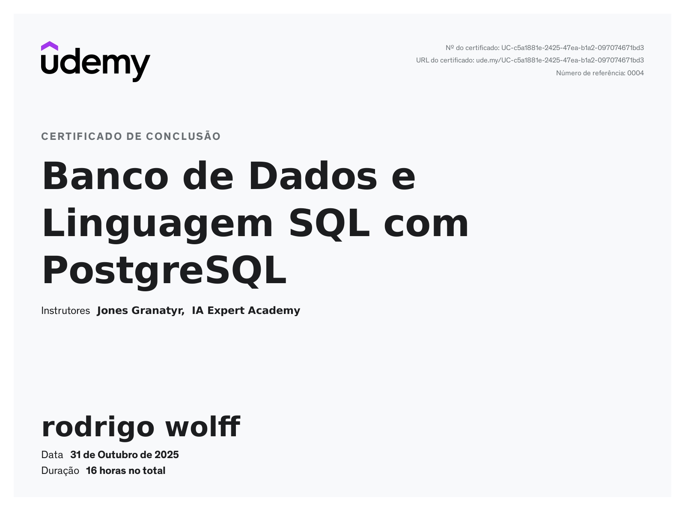

# SQL Database Projects

This repository contains SQL projects developed during a Database Fundamentals course.  
The scripts were created using PostgreSQL and include examples of DDL, DML, and complex queries.

## 📚 Projects

### 1. Customer Orders Database
A simulation of a commercial system including:
- Customers, products, orders, and shipments
- Foreign keys and relationships
- Aggregation functions and views
- Practice queries based on real exercises

📄 Files:
- `scripts.sql`: Full schema and queries
- `scripts.sql`: Challenge at the course for improve yours skills

### 2. Library Management System
A library database project featuring:
- Books, authors, publishers, categories, and loans
- Sequences, views, and aggregation
- Loan and return tracking for each student

📄 Files:
- `evaluation.sql`: Full schema and exercises

## 🛠️ Technologies
- **PostgreSQL**
- **SQL DDL/DML**
- **Foreign keys & constraints**
- **Views and indexes**
- **Aggregation and subqueries**

## 📜 Certificate

